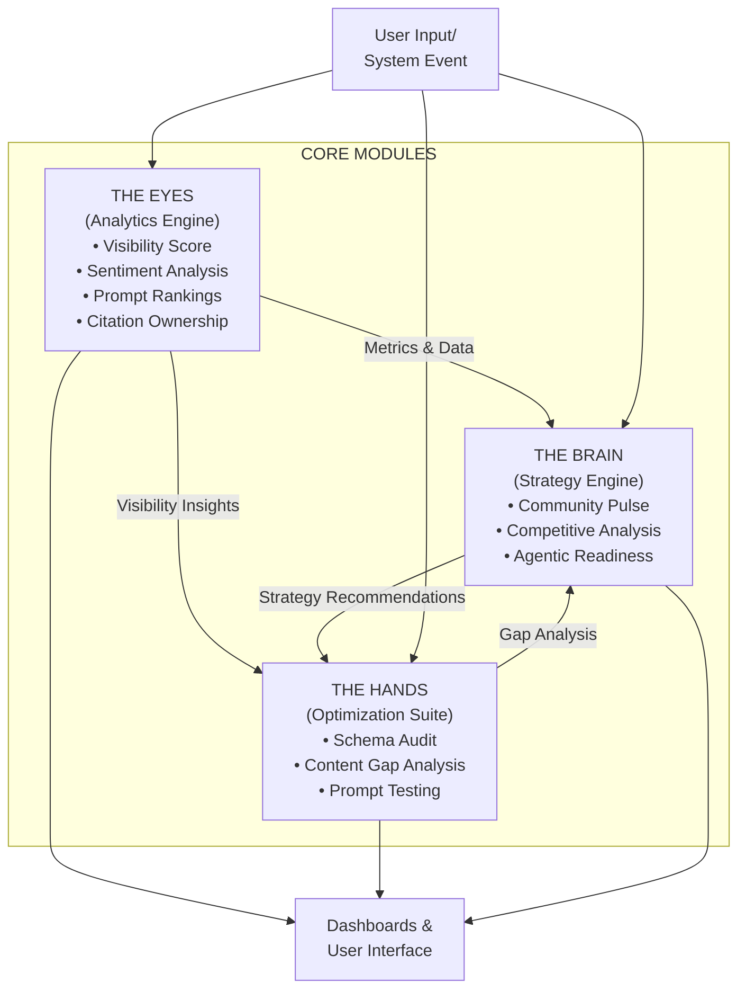
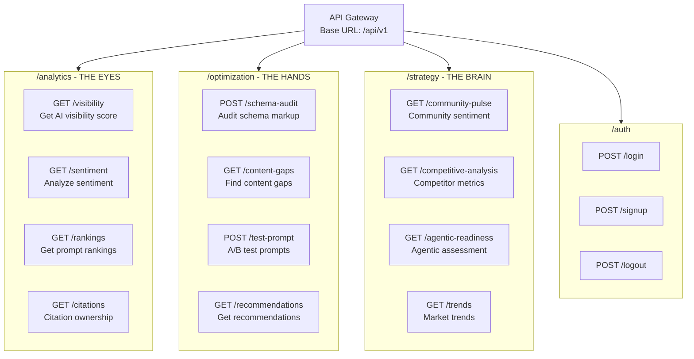
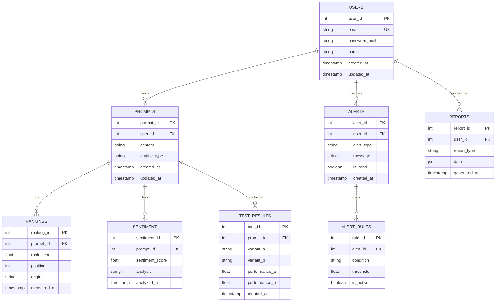
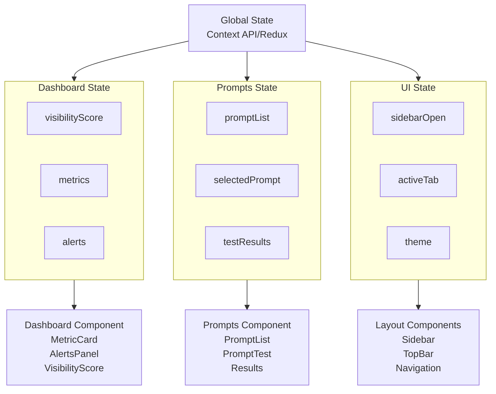
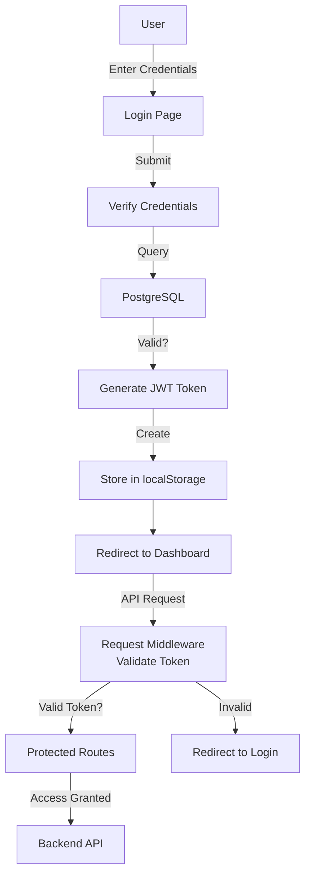

# Sentinel AI

Generative Engine Optimization (GEO) and Answer Engine Optimization (AEO) platform prototype.

## Overview

Sentinel AI is an intelligent analytics and optimization platform designed to help businesses monitor their visibility across generative AI engines and answer engines. The platform provides real-time insights into AI visibility, citation ownership, sentiment analysis, and competitive positioning while offering actionable optimization strategies.

---

## System Architecture

### High-Level Architecture Diagram

```
┌─────────────────────────────────────────────────────────────────────────┐
│                          USER INTERFACE LAYER                           │
│                                                                         │
│  ┌──────────────┐  ┌──────────────┐  ┌──────────────┐  ┌────────────┐   │
│  │   Dashboard  │  │  Prompts     │  │  Alerts      │  │  Settings  │   │
│  │   (Analytics)│  │  Management  │  │  Panel       │  │  & Config  │   │
│  └──────────────┘  └──────────────┘  └──────────────┘  └────────────┘   │
│                                                                         │
│           React + TypeScript + Tailwind CSS + Shadcn/ui                 │
└──────────────────────────┬──────────────────────────────────────────────┘
                           │
                    HTTP/REST API
                           │
┌──────────────────────────▼──────────────────────────────────────────────┐
│                      API GATEWAY & ROUTING LAYER                        │
│                                                                         │
│                    Vite Dev Server / Production Build                   │
│                                                                         │
└──────────────────────────┬──────────────────────────────────────────────┘
                           │
                    HTTP/REST API
                           │
┌──────────────────────────▼──────────────────────────────────────────────┐
│                     BACKEND SERVICE LAYER (FastAPI)                     │
│                                                                         │
│  ┌────────────────────────────────────────────────────────────────────┐ │
│  │                    API Routes & Controllers                        │ │
│  │                                                                    │ │
│  │  ┌──────────────┐  ┌──────────────┐  ┌──────────────┐              │ │
│  │  │  Analytics   │  │ Optimization │  │  Strategy    │              │ │
│  │  │  Routes      │  │  Routes      │  │  Routes      │              │ │
│  │  │              │  │              │  │              │              │ │
│  │  │ • Visibility │  │ • Schema     │  │ • Community  │              │ │
│  │  │ • Sentiment  │  │   Audit      │  │   Pulse      │              │ │
│  │  │ • Rankings   │  │ • Content    │  │ • Agentic    │              │ │
│  │  │              │  │   Gap        │  │   Readiness  │              │ │
│  │  └──────────────┘  └──────────────┘  └──────────────┘              │ │
│  │                                                                    │ │
│  └────────────────────────────────────────────────────────────────────┘ │
│                                                                         │
│  ┌────────────────────────────────────────────────────────────────────┐ │
│  │              Business Logic & Services Layer                       │ │
│  │                                                                    │ │
│  │  ┌──────────────┐  ┌──────────────┐  ┌──────────────┐              │ │
│  │  │ LLM Service  │  │ Scraper      │  │  Analytics   │              │ │
│  │  │              │  │  Service     │  │  Service     │              │ │
│  │  │ • OpenAI     │  │              │  │              │              │ │
│  │  │ • Anthropic  │  │ • Web Parse  │  │ • Metric     │              │ │
│  │  │ • RAG Logic  │  │ • Schema     │  │   Calc       │              │ │
│  │  │              │  │   Extract    │  │ • Trending   │              │ │
│  │  └──────────────┘  └──────────────┘  └──────────────┘              │ │
│  │                                                                    │ │
│  └────────────────────────────────────────────────────────────────────┘ │
│                                                                         │
└──────────────────────────┬──────────────────────────────────────────────┘
                           │
        ┌──────────────────┼──────────────────┐
        │                  │                  │
        ▼                  ▼                  ▼
┌──────────────┐   ┌──────────────┐   ┌──────────────┐
│  PostgreSQL  │   │   Pinecone   │   │  External    │
│  Database    │   │  Vector DB   │   │  APIs        │
│              │   │              │   │              │
│ • Prompts    │   │ • Embeddings │   │ • Web Search │
│ • Metrics    │   │ • RAG Index  │   │ • Content    │
│ • Users      │   │              │   │   Scraping   │
│ • Alerts     │   │              │   │              │
└──────────────┘   └──────────────┘   └──────────────┘
```

### Architecture Components

#### 1. **Frontend Layer** (React + TypeScript + Vite)
- **Dashboard**: Central analytics hub displaying key metrics
- **Prompts Management**: Interface for managing and testing prompts
- **Alerts Panel**: Real-time notifications and updates
- **Navigation**: Sidebar-based routing with mobile responsiveness
- **UI Components**: Shadcn/ui component library with Tailwind styling

#### 2. **Backend Service Layer** (FastAPI + Python)
- **Analytics Module** ("The Eyes"): Prompt ranking, visibility metrics, sentiment analysis
- **Optimization Module** ("The Hands"): Schema auditing, content gap analysis, recommendations
- **Strategy Module** ("The Brain"): Community sentiment, agentic readiness assessment

#### 3. **Data Layer**
- **PostgreSQL**: Primary relational database for user data, prompts, metrics, and alerts
- **Pinecone Vector DB**: Semantic search and RAG (Retrieval-Augmented Generation) capabilities
- **External APIs**: Web scraping, content analysis, and third-party integrations

---

## User Interaction Flowchart

```
┌─────────────────────────────────────────────────────────────────┐
│                      USER STARTS APPLICATION                     │
└────────────────────────────┬────────────────────────────────────┘
                             │
                             ▼
                    ┌────────────────────┐
                    │   Authentication   │
                    │   (Login/Signup)   │
                    └────────────┬───────┘
                                 │
                    ┌────────────▼──────────────┐
                    │   Onboarding Flow?        │
                    │   (New User)              │
                    └────────────┬──────────────┘
                                 │
                    ┌────────────▼──────────────┐
                    │   Dashboard Landing      │
                    │   - AI Visibility Score  │
                    │   - Key Metrics          │
                    │   - Recent Alerts        │
                    └────────────┬──────────────┘
                                 │
        ┌────────────────────────┼────────────────────────────┐
        │                        │                            │
        ▼                        ▼                            ▼
   ┌────────────┐          ┌────────────┐          ┌────────────┐
   │  Analytics │          │  Prompts   │          │  Alerts &  │
   │   View     │          │ Management │          │ Monitoring │
   └─┬──────────┘          └─┬──────────┘          └─┬──────────┘
     │                       │                       │
     ▼                       ▼                       ▼
  ┌──────────────┐    ┌──────────────┐    ┌──────────────┐
  │ • Visibility │    │ • Create New │    │ • View Live  │
  │   Score      │    │   Prompt     │    │   Alerts     │
  │ • Citations  │    │ • Test Prompt│    │ • Set Rules  │
  │ • Sentiment  │    │ • View       │    │ • Trend Info │
  │ • Rankings   │    │   History    │    │              │
  │ • Share of   │    │ • Analyze    │    └──────────────┘
  │   Voice      │    │   Results    │
  └──────────────┘    └──────────────┘
        │                    │
        │                    │
        └────────────────────┼────────────────────┐
                             │                    │
                             ▼                    ▼
                   ┌────────────────────┐  ┌───────────────────┐
                   │  Data Fetching &   │  │  Optimization     │
                   │  Backend API Call  │  │  Recommendations. │
                   │                    │  │                   │
                   │ • Prompt Analysis  │  │ • Schema Audit.   │
                   │ • Metric Calc      │  │ • Content Gaps    │
                   │ • Sentiment        │  │ • Action Items.   │
                   │   Scoring          │  └───────────────────┘
                   └────────┬───────────┘
                            │
                    ┌───────▼──────────┐
                    │  Display Results │
                    │  in Dashboard    │
                    └────────┬─────────┘
                             │
                    ┌────────▼──────────┐
                    │  User Actions     │
                    │                   │
                    │ • Export Data     │
                    │ • Set Alerts      │
                    │ • Run Tests       │
                    │ • Save Reports    │
                    └────────┬──────────┘
                             │
                    ┌────────▼──────────┐
                    │  Continue/Exit    │
                    │  Session          │
                    └───────────────────┘
```

### Data Flow Diagram

```
┌──────────────┐
│  User Input  │
│  (Frontend)  │
└──────┬───────┘
       │
       ▼
┌─────────────────────────────┐
│  Frontend State Management  │
│  (React Hooks/Context)      │
└──────┬──────────────────────┘
       │
       ▼
┌─────────────────────────────┐
│  API Request Handler        │
│  (HTTP POST/GET/PUT/DELETE) │
└──────┬──────────────────────┘
       │
       ▼
┌─────────────────────────────────────────┐
│  Backend Route Processing               │
│  - Request Validation                   │
│  - Authentication Check                 │
│  - Route Handler Execution              │
└──────┬──────────────────────────────────┘
       │
       ▼
┌─────────────────────────────────────────┐
│  Service Layer Logic                    │
│ - Analytics Calculations                │
│ - Optimization Analysis                 │
│ - Strategy Processing                   │
│ - Data Transformation                   │
└──────┬──────────────────────────────────┘
       │
       ├─────────────────┬─────────────────┐
       │                 │                 │
       ▼                 ▼                 ▼
 ┌─────────────┐ ┌─────────────┐ ┌──────────────┐
 │ PostgreSQL  │ │  Pinecone   │ │  External    │
 │  Database   │ │  Vector DB  │ │  Services    │
 │   Query/    │ │  Embedding/ │ │   (APIs)     │
 │   Write     │ │  Search     │ │              │
 └──────┬──────┘ └──────┬──────┘ └────────┬─────┘
        │               │                 │
        └───────────────┼─────────────────┘
                        │
                        ▼
        ┌───────────────────────────────┐
        │  Response Aggregation         │
        │  & Formatting                 │
        └───────────────┬───────────────┘
                        │
                        ▼
        ┌───────────────────────────────┐
        │  JSON Response to Frontend    │
        │  (HTTP 200/201/400/500)       │
        └───────────────┬───────────────┘
                        │
                        ▼
        ┌───────────────────────────────┐
        │  Frontend Response Handling   │
        │  - Parse JSON                 │
        │  - Update State               │
        │  - Handle Errors              │
        └───────────────┬───────────────┘
                        │
                        ▼
        ┌───────────────────────────────┐
        │  UI Rendering & Display       │
        │  Updated Dashboard/Views      │
        └───────────────────────────────┘
```

### Module Interaction Diagram (The Eyes, Hands, Brain)



### API Endpoint Organization



### Database Schema Diagram



### State Management Flow



### Authentication & Authorization Flow



---

## Module Breakdown

### Module 1: "The Eyes" (Analytics Engine)
**Responsibility**: Monitor and analyze AI visibility across engines
- **Visibility Score**: Aggregate metric showing presence in generative engines
- **Sentiment Analysis**: Analyze sentiment of citations and mentions
- **Prompt Rankings**: Track how specific prompts rank across engines
- **Citation Ownership**: Identify brand ownership of citations

### Module 2: "The Hands" (Optimization Suite)
**Responsibility**: Provide actionable optimization recommendations
- **Schema Audit**: Analyze and recommend structured data improvements
- **Content Gap Analysis**: Identify missing content opportunities
- **Prompt Testing**: Run A/B tests on different prompt variations

### Module 3: "The Brain" (Strategy)
**Responsibility**: Provide strategic insights and readiness assessments
- **Community Pulse**: Monitor community sentiment and trends
- **Competitive Analysis**: Track competitor positioning and performance
- **Agentic Readiness**: Assess platform readiness for agentic interactions

---

## Implementation Plan

### Goal Description
Build a high-fidelity prototype for "SENTINEL AI," a GEO (Generative Engine Optimization) platform. The system will feature a modern React dashboard and a Python FastAPI backend to handle SEO/AEO analytics and optimization tasks.

### User Review Required
> [!IMPORTANT]
> This is a prototype build. Actual integration with live LLM APIs (OpenAI, Anthropic) and Vector Databases (Pinecone) will be architected but may use mock data for initial UI/UX demonstration if API keys are not provided.
> The "Citation Node Map" will be implemented using a graph visualization library (e.g., `react-force-graph` or `recharts` dependent on complexity).

### Proposed Changes

#### Project Structure
Root directory: `/sentinel-ai`
- `backend/`: FastAPI Python application
- `frontend/`: React Vite application

#### Backend [Python/FastAPI]
**[NEW] `backend/requirements.txt`**
Dependencies: `fastapi`, `uvicorn`, `sqlalchemy`, `pydantic`, `beautifulsoup4`, `requests`, `python-dotenv`.

**[NEW] `backend/app/main.py`**
Entry point for the API.

**[NEW] `backend/app/api/`**
- `routes/analytics.py`: Endpoints for "The Eyes" (Prompt ranking, Sentiment).
- `routes/optimization.py`: Endpoints for "The Hands" (Schema audit, Content gap).
- `routes/strategy.py`: Endpoints for "The Brain" (Community pulse, Agentic readiness).

**[NEW] `backend/app/services/`**
- `llm_service.py`: Stub/Interface for LLM interactions.
- `scraper_service.py`: Logic for parsing HTML/Schema.

#### Frontend [React/Vite/Tailwind]
**[NEW] `frontend/package.json`**
Dependencies: `react`, `react-dom`, `lucide-react`, `recharts`, `framer-motion` (for animations), `clsx`, `tailwind-merge`.

**[NEW] `frontend/tailwind.config.js`**
Configuration for "Deep Navy" (#0a192f or similar) and "Electric Teal" (#64ffda).

**[NEW] `frontend/src/components/layout/`**
- `Sidebar.tsx`: Navigation.
- `DashboardLayout.tsx`: Main wrapper.

**[NEW] `frontend/src/pages/`**
- `Dashboard.tsx`: The "Commander" view.
- `Analytics.tsx`: Detailed data views.

**[NEW] `frontend/src/components/dashboard/`**
- `VisibilityMeter.tsx`: Gauge chart.
- `CitationNodeMap.tsx`: Visual graph component.
- `RevenueWidget.tsx`: Stats display.
- `ActionList.tsx`: AEO To-Do list.

### Verification Plan

#### Automated Tests
- Backend: Run `pytest` (if added) or manual curl requests to endpoints.
- Frontend: Run `npm run dev` and verify UI renders.

#### Manual Verification
- Start Backend: `uvicorn app.main:app --reload`
- Start Frontend: `npm run dev`
- User walkthrough of the specific Dashboard features (Visibility Meter, Graph, Sidebar).